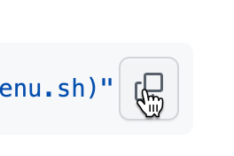

# Loop patches
These patches are intended for Loop 3.0 or 3.2, with or without loop n learn patches.

## How to apply a patch:
First, download Loop by using the loop and learn build script described here: https://www.loopandlearn.org/build-select/

### To select apply (or revert) patches, run the following command:
```console
/bin/bash -c "$(curl -fsSL https://raw.githubusercontent.com/bjorkert/patches/master/menu.sh)"
```
Copy the command using the copy-button (as shown in the picture below), paste (⌘ V) it into your terminal, and press Enter.
 


&nbsp;

## Manual Bolus Threshold
This patch provides a separate suspend threshold for meal and manual bolusing at 54 mg/dL (3 mmol/L), which can be easily modified after applying the patch.
&nbsp;
## Omnipod Dash Site Change
When replacing a pod, this patch ensures that Loop updates Nightscout with a 'Pump Site Change'-treatment, resulting in an updated 'CAGE'-pill and pod change reminder in Loop Follow. Please note that this will happen on the next pod change after the patch is applied, and the date of current pod will not be updated.
&nbsp;
## Dexcom G6 - Sensor Change
When replacing a sensor, this patch ensures that Loop updates Nightscout with a 'Sensor Change' treatment, resulting in an updated 'SAGE' pill and a sensor change reminder in Loop Follow. Please note that the start date of the current sensor will be populated.
&nbsp;
## Dexcom G6 - Upload Readings
This patch automatically sets the 'Upload readings' option to 'On' by default when changing the transmitter. This change addresses the common issue of users forgetting to change the setting, resulting in no blood sugar values being sent to Nightscout.
&nbsp;
## View PreMeal in Nightscout
Due to overrides now being combinable with PreMeal, PreMeal is no longer sent as an override to Nightscout, leaving Nightscout without any indication that PreMeal is active. This patch addresses this issue by sending a Temporary target to Nightscout when PreMeal is turned on, resulting in a visual band in Nightscout to indicate that PreMeal is active. When PreMeal is turned off, the temporary target band is also ended.
&nbsp;
## Future carbs 90 minutes
This patch makes it possible to enter carbs 90 minutes into the future in order to register carbs for protein and fat. Loop 3 limits the future time change allowed to 1 hour. Remember that Loop may increase insulin dosing for future carbs - make sure that they actually arrive and are not already taken care of by your basal.
&nbsp;
## Display Required Carbs on App Badge
Install this patch to see a small number on your Loop app badge, indicating the predicted amount of glucose needed to maintain your target range. This value is calculated using your current Carb Ratio (CR) and Insulin Sensitivity Factor (ISF). The code originates from the latest FreeAPS version and should not be impacted by the time zone bug.
&nbsp;
## Dash Fast Forward
When pairing a new pod, the abundance of unnecessary clicks and confirmations in Loop 3.x can be quite cumbersome. As an experienced looper, you likely breeze through them as quickly as possible without actually reading them. This patch streamlines the process by eliminating the unnecessary dialogs and retaining only the essential ones—"Pair Pod" and "Insert Cannula"—where actual actions take place. As a result, the patch effectively reduces clicks and enhances the user experience.
&nbsp;
## Basic I:C Bolus Calculation
This patch introduces a new feature in the meal bolus screen to calculate a basic insulin-to-carb (I:C) bolus without considering the glucose prediction. The purpose of this addition is to provide users with an alternative bolus calculation method when Loop's automatic bolus recommendation is not suitable for their specific situation.

Users might encounter scenarios where their blood glucose is predicted to drop below the desired range, causing Loop to recommend against bolusing. Loop will then wait with the insulin until blood glucose rises, possibly resulting in a spike.

To address this issue, a new row has been added in the bolus entry screen, labeled "Basic I:C Bolus Calc." This row displays the calculated bolus based on the user's insulin-to-carb ratio, the entered carbohydrates and existing carbs on board without factoring in current bg value, glucose predictions or override. The calculation will consider positive insulin on board (IOB) and ignore negative IOB to avoid over-bolusing.

**Warning: This feature is designed as a basic calculation tool and does not consider all factors that may affect blood sugar levels. The calculated bolus provided by the "Basic I:C Bolus Calc" is _not_ a recommended bolus and may not be suitable for all users. Giving too much insulin can be dangerous and cause low blood sugar levels. Always consult with your healthcare provider before making any changes to your diabetes management plan.**

To use this feature, users can simply tap the 'Basic I:C Bolus Calc' row, and the app will update the bolus entry field with the calculated value. The suggested bolus value will always be displayed in red, indicating that it is calculated differently from Loop's default recommendation. The user can then proceed to deliver the bolus manually.

Calculation Example:
Assume a user has an insulin-to-carb ratio of 1:10, meaning 1 unit of insulin covers 10 grams of carbohydrates. They enter a meal with 50 grams of carbohydrates, their current positive IOB is 1 unit, and they have 20 grams of carbs on board.

Using the Basic I:C Bolus Calc, the calculation would be as follows:

Total carbs: 50 grams of entered carbs + 20 grams of carbs on board = 70 grams
Unadjusted bolus: 70 grams of total carbs / 10 (I:C ratio) = 7 units of insulin
Bolus with IOB: 7 units (unadjusted) - 1 unit (positive IOB) = 6 units
In this case, the user is presented with the option to deliver a 6-unit bolus manually.

Loop's recommendation remains the default option, and there are scenarios where Loop would recommend more insulin than the basic calculation, such as when the blood glucose value is too high and Loop includes a correction in the dosage.

With this patch, the feature to click on Loop's recommended value to copy it to the entered bolus value is restored (it was removed in Loop 3).
&nbsp;
&nbsp;
# Loop Follow patches
These patches are intended for the development branch of Loop Follow.
## How to apply a patch:
First, download Loop Follow dev by using the loop and learn build script described here: https://www.loopandlearn.org/build-select/
### Run the command below to select the patches you want to apply or revert
```console
/bin/bash -c "$(curl -fsSL https://raw.githubusercontent.com/bjorkert/patches/master/lf.sh)"
```
Please use the copy-button (as shown in the picture below) to copy the command, then paste it (⌘ V) into your terminal and press Enter.


## Blue Line -30 minutes
A blue line is added 30 minutes prior to the current time to provide a clearer view of the boluses that have started to take effect.
I described it in this issue, resulted in some modifications but not the blue line. https://github.com/jonfawcett/LoopFollow/issues/110
&nbsp;
## Protein line -90 minutes
An additional line is added to the graph 90 minutes prior to the current time to indicate if a meal is causing a blood sugar rise 90 minutes later, which may be due to protein that typically takes about 90 minutes to show its effects.
&nbsp;
## Duplicate blood glucose entries
Loop 3 may upload duplicate svg entries, which can cause issues with LoopFollow's graphs and statistics. This issue may also arise when both bridge is enabled in Nightscout and Loop 'upload readings' are used. This patch resolves the issue by filtering out one reading every five minutes. I have submitted a pull request for this fix, which can be found at https://github.com/jonfawcett/LoopFollow/pull/178.
&nbsp;
## Carbs Today
This patch adds a new item to the 'Information Table' called 'Carbs Today.' This feature provides a sum of all registered carbs since midnight to help you keep track of your child's carb intake for the day. However, please note that this feature may not be useful if you are using fake carbs.
&nbsp;
## PreMeal
The graph displays the PreMeal period as an orange band located below the green override band.
&nbsp;
## Speak BG
The Speak BG functionality had been experiencing issues for a while, but it has now returned, more powerful than ever. Not only will it announce the present BG value, but it will also provide the difference between the current reading and the previous one.
&nbsp;
## Home Screen Quick Action for Speak BG
Now you can easily toggle the "Speak BG" feature on and off directly from your home screen! I've added a Home Screen Quick Action that lets you control the feature with just a 3D touch on the LoopFollow app icon.
- **Home Screen Quick Action**: Quickly toggle "Speak BG" without going through the settings screens.
- **Synced Settings**: The switch in General Settings and the Quick Action are in sync.
- **Audible Confirmation**: Get instant feedback when you toggle the feature using the Quick Action.
