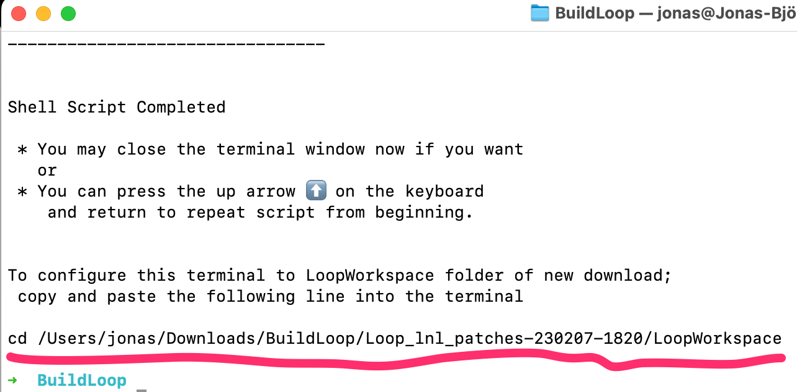
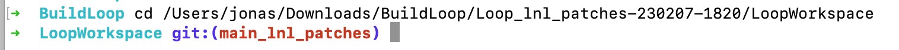

These patches are designed for the pre-patched loop and learn version of Loop 3.0 using the Xcode build method.

## How to apply a patch:
First, download Loop using the loop and learn build script described here: https://www.loopandlearn.org/build-select/

### Download Loop
When you have downloaded loop, the terminal window should look something like the picture below. Note the underlined text in the picture, select and copy (⌘ C) that text from your terminal, include the whole row from "cd" all the way to "LoopWorkspace".


### Change folder
Paste (⌘ V) the command in your terminal and hit enter.


### Run the command below to select the patches you want to apply or revert
```console
/bin/bash -c "$(curl -fsSL https://raw.githubusercontent.com/bjorkert/patches/master/menu.sh)"
```
Copy the command using the copy-button (see picture blow) and paste (⌘ V) it in your terminal and hit enter. 

&nbsp;
# Loop patches

## Manual Bolus Threshold
Separate suspend threshold for meal and manual bolusing, 54 mg/dL (3 mmol/L) - this value can easily be modified after the patch is applied.
&nbsp;
## Overlapping override bugfix
There is a bug in Loop when it comes to overlapping overrides. If you manage to get overlapping overrides, Loop will crash and will not be able to start again until 48 hours has passed. I have made a pull request to resolve this (https://github.com/LoopKit/LoopKit/pull/449), a fix is available here until the pull request is approved.
&nbsp;
## Omnipod Dash Site Change
Update Nightscout with a "Pump Site Change"-treatment when replacing a pod. This results in updated "CAGE"-pill and pod change reminder in Loop Follow.
&nbsp;
## Dexcom G6 - Sensor Change
Update Nightscout automatically with the "Sensor Change" treatment when you replace a sensor. This leads to an updated "SAGE" pill and a sensor change reminder in Loop Follow. Please note that the start date of the current sensor will be populated.
&nbsp;
## Dexcom G6 - Upload Readings
This patch makes the "Upload readings" default On when changing transmitter.
&nbsp;
## View PreMeal in Nightscout
Show PreMeal in Nightscout as Temporary target.
&nbsp;
&nbsp;
# Loop Follow patches
These patches are designed for the dev branch of Loop Follow using the Xcode build method.

You need to be in the "LoopFollow" folder when these commands are executed.

## Blue Line -30 minutes
A blue line 30 minutes back in time to get a clearer view of what boluses has started to give effect.
I described it in this issue, resulted in some modifications but but the blue line. https://github.com/jonfawcett/LoopFollow/issues/110
```console
git apply <<< $(curl -s https://raw.githubusercontent.com/bjorkert/patches/master/lf_blue_line.patch)
```
&nbsp;
## Protein line -90 minutes
Another line, this one 90 minutes back in time to get an indication of if a meal is causing a bs raise 90 minutes later due to protein.
```console
git apply <<< $(curl -s https://raw.githubusercontent.com/bjorkert/patches/master/proteinLine.patch)
```
&nbsp;
## Duplicate blood glucose entries
Loop 3 is uploading duplicate svg entries, this messes up the LoopFollow graphs and statistics. This can also happen if you have both bridge enabled in nightscout as well as Loop "upload readings". This patch solves that problem by filtering out 1 reading per 5 minutes. I have made a pull request for this fix: https://github.com/jonfawcett/LoopFollow/pull/178
```console
git apply <<< $(curl -s https://raw.githubusercontent.com/bjorkert/patches/master/removeSVGDuplicates.patch)
```